# Parcours et séquences

Diagrammes des fonctionnalités ajoutées lors de la professionnalisation.

Ils ne sont pas décoratifs : **les tracer a révélé dix ruptures** au fil
de trois passes, et c'est en les corrigeant que ce document a pris sa
forme actuelle. Chaque section signale, sous le diagramme, ce que le
tracé a fait apparaître.

La règle qui a servi de grille de lecture, et qui vaut pour les
prochaines fonctionnalités : **une flèche entrante sans écran pour la
recevoir est un trou ; un acteur sans chemin pour l'atteindre aussi.**

Les diagrammes sont en Mermaid : GitHub les rend directement.

---

## Carte de navigation

Où vivent les écrans ajoutés, et par où on y arrive. Deux d'entre eux
n'étaient **reliés à rien** avant ce travail.

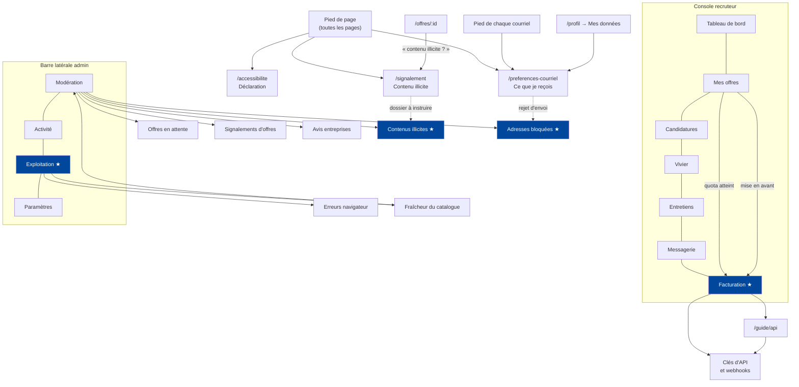

★ **Ce que le tracé a corrigé, en deux passes.**

*Première passe* — `/recruteur/facturation` et `/admin/exploitation`
existaient sans qu'aucun lien n'y mène. Deux pages complètes,
atteignables seulement en tapant l'adresse de mémoire, autant dire
inexistantes. Ajoutées à la sous-navigation du recruteur et à la barre
latérale de l'administration, cette dernière avec ses alias de recherche
(`santé`, `erreurs`, `fraîcheur`).

*Seconde passe* — la règle appliquée cette fois : **tout ce qui se
dépose doit avoir quelqu'un pour le traiter.** Elle a révélé deux
impasses plus graves que des liens manquants :

- Les **signalements de contenu illicite** arrivaient, recevaient leur
  accusé de réception et leur référence de suivi… et s'accumulaient dans
  une table qu'aucun écran n'affichait. Le règlement impose une décision
  motivée ; aucune ne pouvait être rendue. Un mécanisme de signalement
  dont rien ne sort n'est pas un mécanisme de signalement.
- Les **adresses qui rebondissent** étaient enregistrées et bloquées
  correctement, mais invisibles. On ne pouvait pas répondre à « pourquoi
  cette personne ne reçoit-elle plus rien ? ».

Les deux sont désormais des onglets de la modération — même métier, même
personne. Deux liens ordinaires manquaient aussi : la documentation de
l'API depuis la facturation, et le centre de préférences depuis le
profil (il n'était atteignable que par le pied de page et les courriels,
c'est-à-dire pas là où on le cherche).

---

## 1. Publier une offre

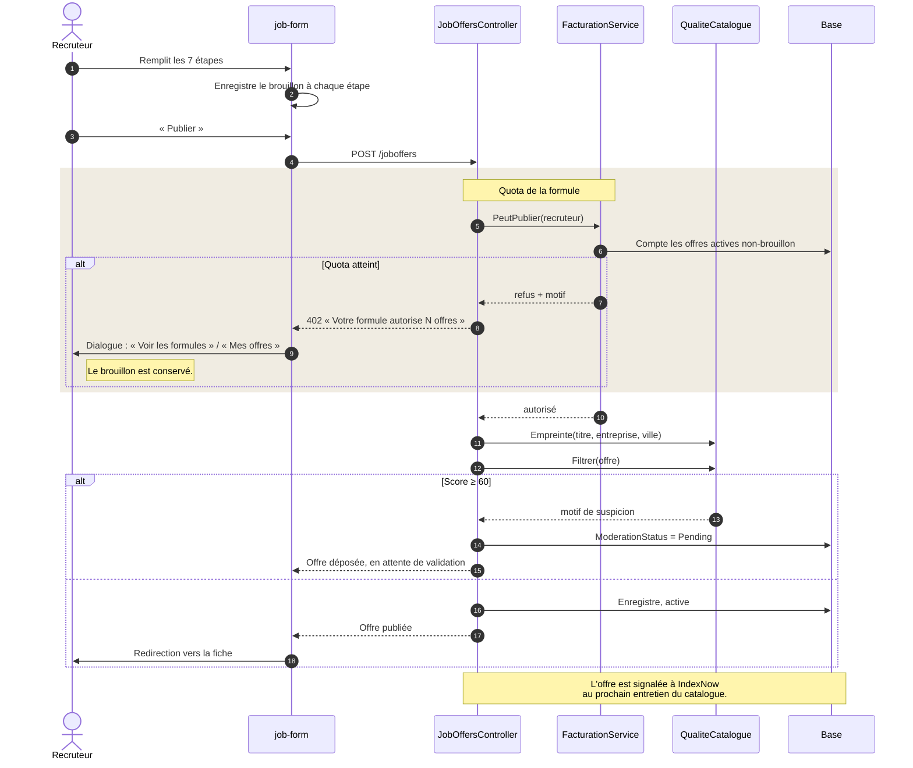

**Ce que le tracé a corrigé.** Le 402 était traité comme une panne
quelconque : « Erreur lors de la creation », après sept écrans de
saisie, sans dire pourquoi ni où aller. Le recruteur recommençait et
échouait à nouveau. Il obtient maintenant le motif exact, le rappel que
son brouillon est conservé, et deux issues explicites.

---

## 2. Mettre une offre en avant

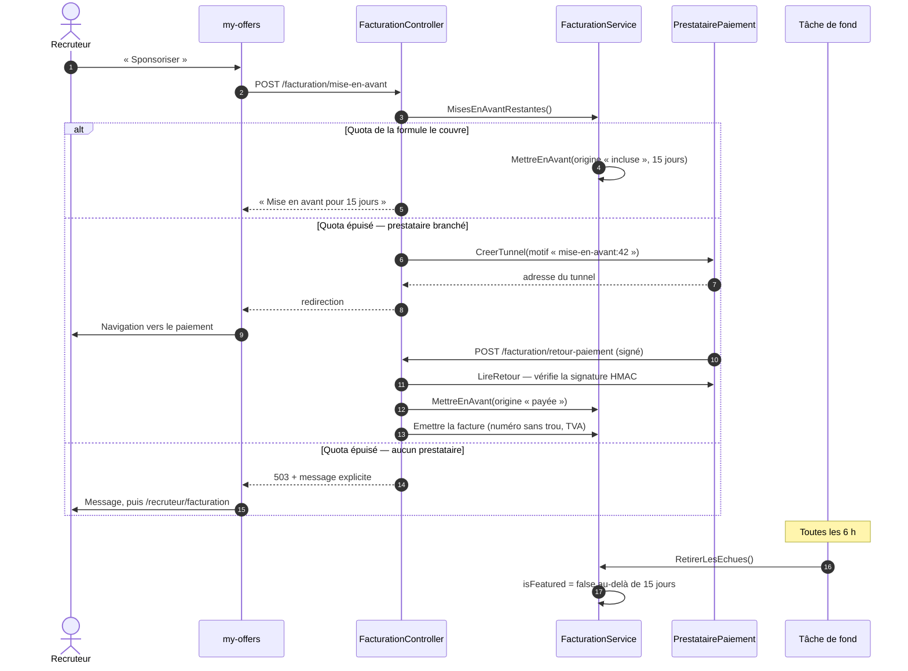

**Ce que le tracé a corrigé — le plus grave des quatre.** Le bouton
« Sponsoriser » appelait encore `toggleFeature`, qui met en avant **sans
rien décompter et sans date de fin**. La mise en avant restait donc
gratuite, illimitée et éternelle : tout le circuit de facturation
existait en parallèle, sans que l'interface ne l'emprunte jamais. Le
bouton passe désormais par la facturation ; seul le *retrait* garde
l'ancien point d'entrée, parce que cesser une mise en avant qu'on a
payée est un droit, pas un achat.

---

## 3. Une candidature arrive

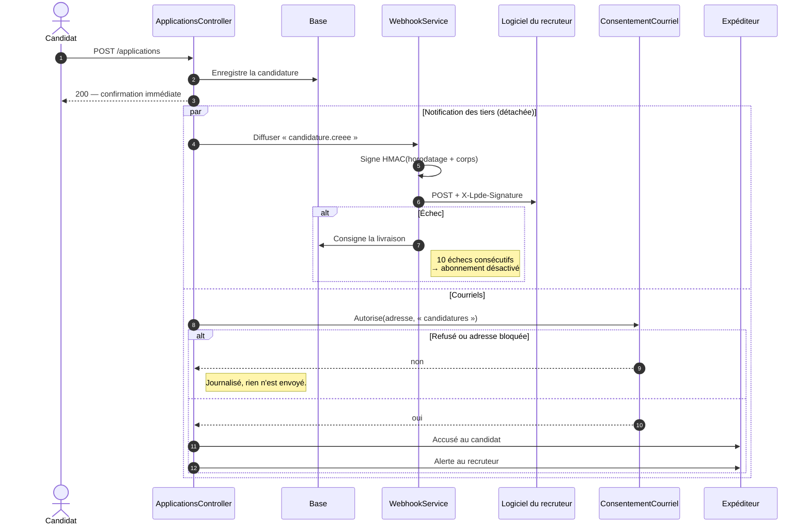

**Ce que le tracé a corrigé.** Deux ruptures. Le `WebhookService` était
écrit, testé, exposé dans l'interface — et **personne ne l'appelait** :
un recruteur pouvait créer un abonnement qui ne recevait jamais rien.
Et `ConsentementCourriel` enregistrait un refus que l'expéditeur ne
lisait pas : on écrivait à qui avait décoché la case. Un refus sans
effet est pire que pas de réglage du tout — il fait croire au réglage,
puis au mensonge.

Noter la barre `par` : les deux branches sont **après** la réponse au
candidat. Un serveur d'ATS lent ne doit pas faire attendre quelqu'un qui
vient de postuler.

---

## 4. Une erreur casse chez un visiteur

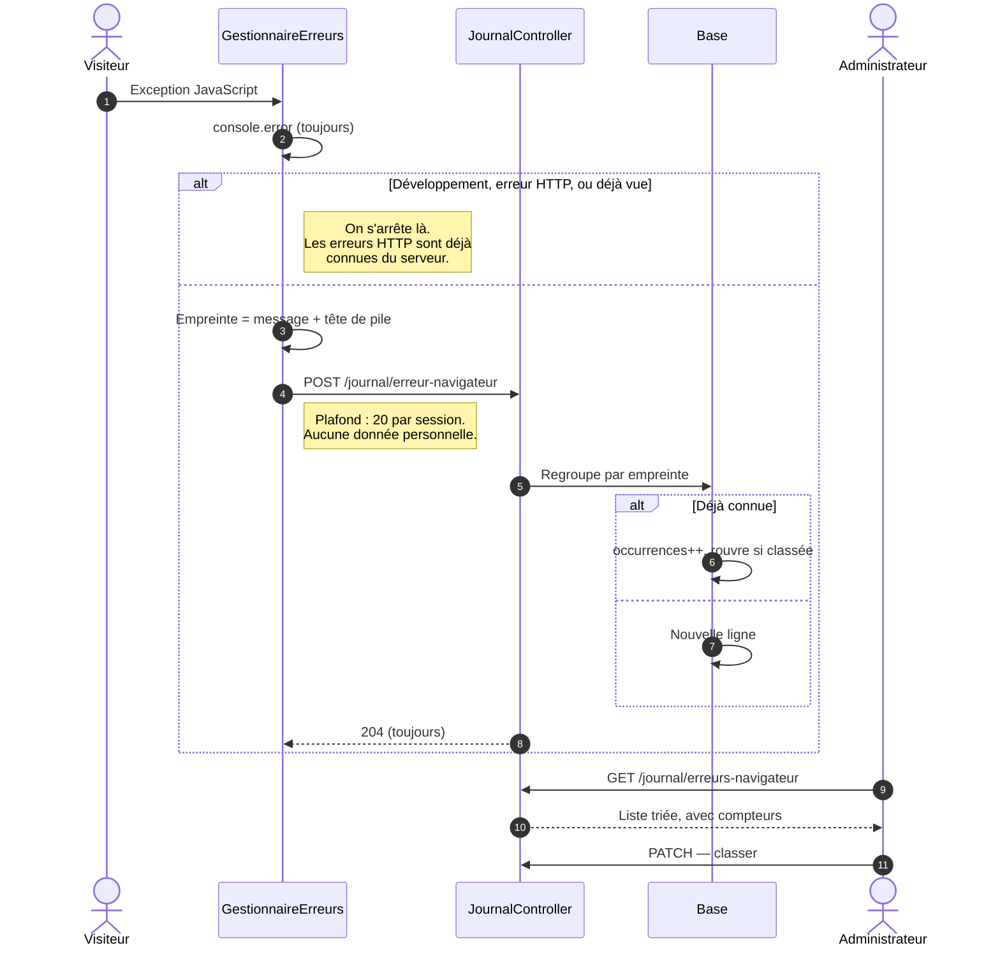

Le 204 systématique n'est pas une négligence : un échec de remontée qui
lèverait produirait une nouvelle exception, elle-même remontée. La
boucle saturerait l'API en quelques secondes.

---

## 5. Import et entretien du catalogue

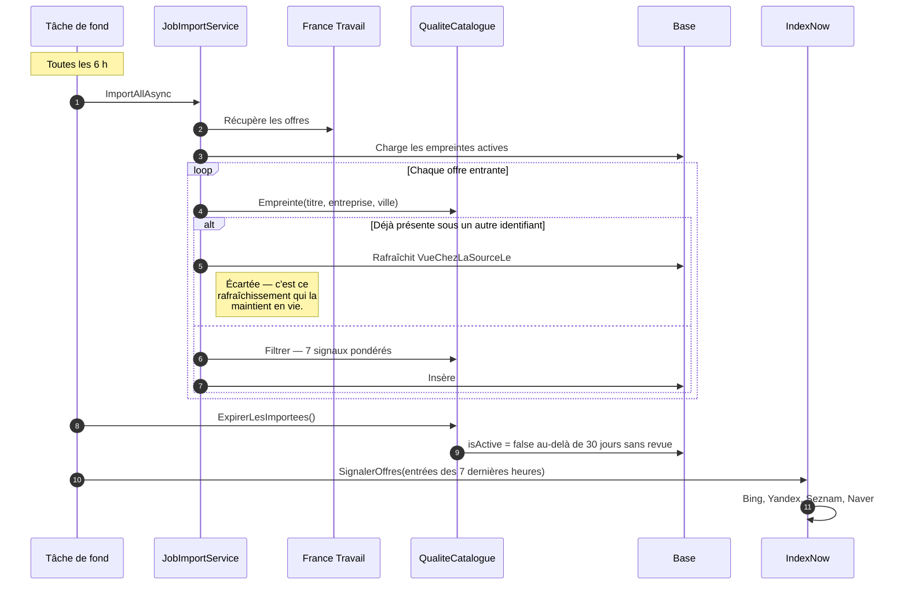

**Ce que le tracé a rendu visible.** L'ordre compte et n'était pas
évident : l'entretien tourne **après** l'import, jamais avant. Une offre
revue chez sa source à l'instant ne doit pas être retirée parce que le
nettoyage est passé cinq minutes plus tôt.

Le dédoublonnage ne se contente pas d'écarter : il **rafraîchit
l'ancienne**. Sans ce geste, l'offre conservée finirait par expirer
alors que sa source la republie à chaque cycle.

---

## 6. Signalement de contenu illicite (DSA)

```mermaid
sequenceDiagram
    autonumber
    actor D as Déclarant
    participant P as /signalement
    participant API as DsaController
    participant Mail as Expéditeur
    actor A as Administration

    D->>P: Depuis le pied de page, ou depuis une offre
    note right of P: Le lien depuis une offre porte<br/>le type et l'identifiant.
    P->>API: GET /signalements/motifs
    D->>P: Motif, exposé (30 car. min.), bonne foi
    P->>API: POST /signalements

    alt Bonne foi non déclarée
        API-->>P: 400 — le texte lui donne un effet juridique
    end

    API->>API: Référence SIG-2026-0001
    alt Adresse fournie
        API->>Mail: Accusé de réception (obligation, « sans retard »)
    else
        API-->>P: « Conservez cette référence »
    end

    rect rgb(240, 236, 226)
        note over A,API: Instruction — /admin/moderation, onglet « Contenus illicites »
        A->>API: GET /signalements?statut=Recu
        API-->>A: Dossiers, exposé compris
        note right of A: L'attente en jours s'affiche ;<br/>au-delà de 3 j, le dossier<br/>est marqué en rouge.
        A->>A: Rédige la motivation (20 car. min.)
        A->>API: PATCH /signalements/{id}
        alt Motivation trop courte
            API-->>A: 400 — « la décision doit être motivée »
        end
    end

    API->>Mail: Décision + voies de recours (art. 21, Arcom)
    D->>API: GET /signalements/{ref} — suivi sans compte
```

**Ce que le tracé a corrigé — deux fois.**

*D'abord l'entrée.* La fiche offre proposait un signalement qui alimente
la modération : rapide, mais sans accusé, sans délai, sans recours.
Quelqu'un qui signale une annonce frauduleuse a droit au mécanisme du
règlement, et n'avait aucun moyen de l'apprendre depuis la fiche. Une
passerelle a été ajoutée dans la modale, qui transporte l'offre : sans
elle, la personne recopie l'adresse à la main.

*Puis la sortie, plus grave.* Le diagramme s'arrêtait sur « A->>API:
PATCH — décision motivée » — un acteur, un appel, et **aucun écran pour
le faire**. Les endpoints d'administration existaient ; rien ne les
appelait. Les dossiers s'accumulaient, chacun avec son accusé de
réception promettant une décision qui ne pouvait pas venir. La rectangle
grisé ci-dessus est l'écran qui manquait : file filtrable par état,
exposé du déclarant, âge du dossier signalé en rouge au-delà de trois
jours, et une motivation exigée avant l'envoi.

Le vocabulaire de l'onglet est délibérément distinct de celui des
signalements ordinaires — « Contenus illicites » — pour que les deux ne
soient pas traités avec le même soin, c'est-à-dire le moindre des deux.

Les deux mécanismes coexistent volontairement — noyer le signalement
courant sous du vocabulaire juridique découragerait ceux qui relèvent
simplement de la modération.

---

## 7. Ce que je reçois, et ce qui rebondit

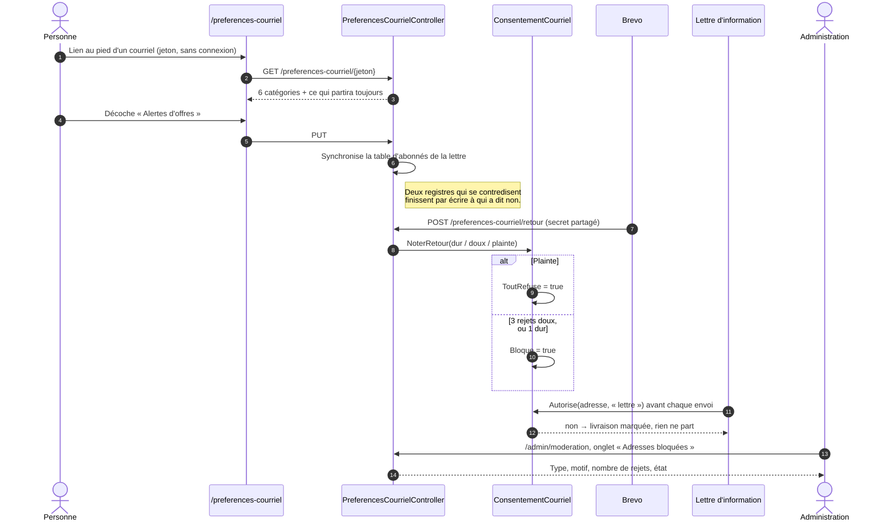

**Ce que le tracé a corrigé.** Le blocage fonctionnait, la table se
remplissait — et rien ne l'affichait. À la question « pourquoi cette
personne ne reçoit-elle plus rien ? », personne ne pouvait répondre
autrement qu'en interrogeant la base à la main. L'onglet répond.

Trois envois échappent au réglage : réinitialisation de mot de passe,
confirmation d'adresse, alerte de connexion. Ils répondent à une action
de la personne ou protègent son compte ; les couper lui nuirait. La page
le dit explicitement plutôt que de le laisser deviner.

---

## 8. Brancher un logiciel de recrutement

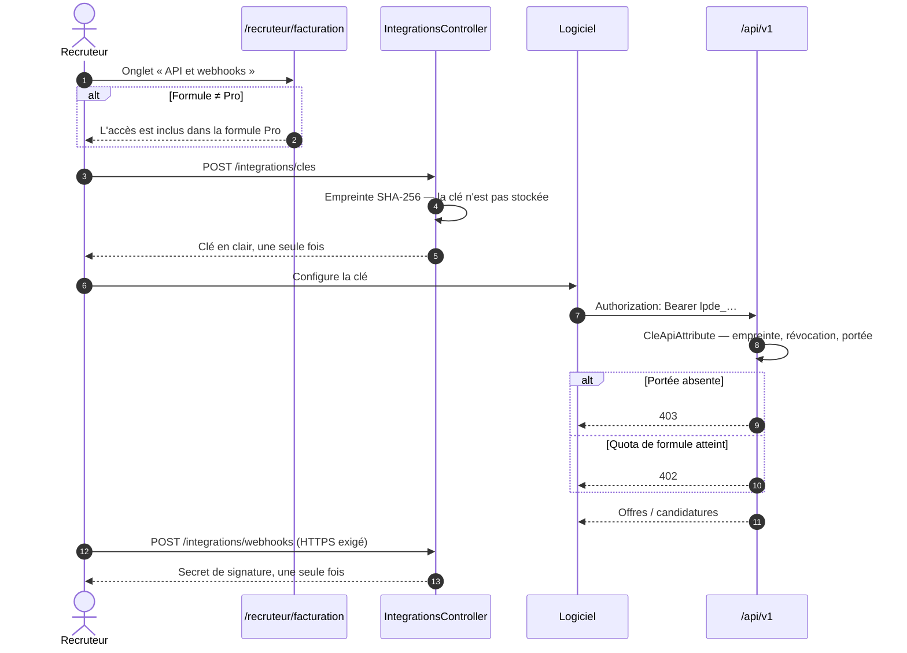

Le même quota s'applique à l'API qu'au site. Sans cela, elle serait la
porte de service qui contourne la facturation.

---

## 9. Un déploiement

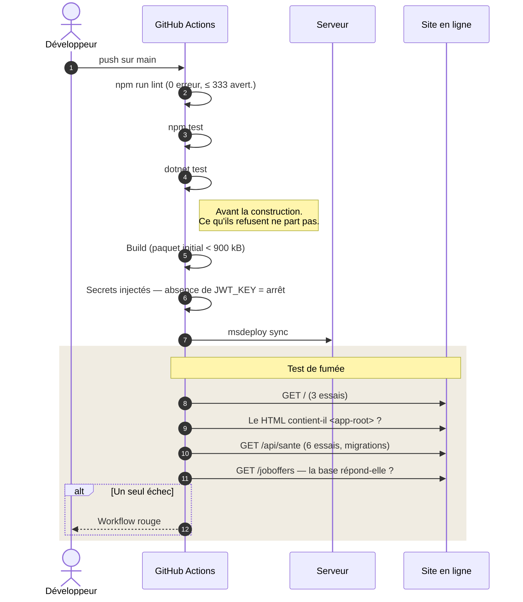

Le workflow passait au vert dès que `msdeploy` rendait la main : il ne
rendait compte que du transfert des fichiers, jamais de ce que le site
répondait ensuite.

---

## 10. Une lecture publique

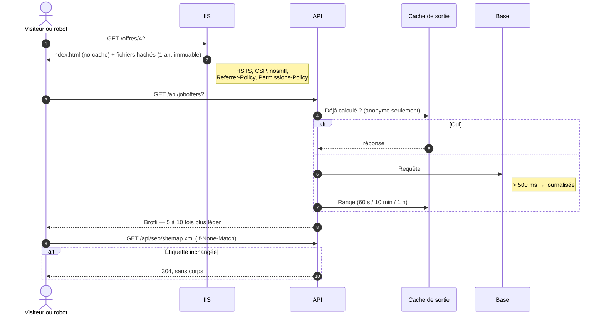

---

## 11. Ce que voit l'administration

Le seul diagramme qui ne décrit pas un parcours mais une **couverture** :
pour chaque chose que la plateforme collecte, qui la traite et où.
Le tableau est la grille à remplir avant d'ajouter quoi que ce soit.

| Ce qui est collecté | Écran qui le traite | Action possible |
|---|---|---|
| Offres en attente | Modération → En attente | Approuver, rejeter avec note |
| Signalements d'offres | Modération → Signalements | Traiter, rejeter |
| Avis d'entreprises | Modération → Avis | Approuver, masquer |
| **Contenus illicites (DSA)** | Modération → Contenus illicites | Décision motivée + recours |
| **Adresses bloquées** | Modération → Adresses bloquées | Consultation |
| Erreurs navigateur | Exploitation | Classer, rouvrir |
| Fraîcheur du catalogue | Exploitation | Vers la fiche offre |
| Offres suspectes (score ≥ 60) | Exploitation → Modération | Approuver, rejeter |
| État des services | Exploitation | Consultation |
| Recettes et abonnements | Exploitation → Recettes | Consultation |
| Livraisons de webhook | Espace recruteur | Consultation par le porteur |
| **Modèles de courriel** | Réglages → Expédition | Aperçu, essai d'envoi |
| **Diffusions partenaires** | Espace recruteur → Offre | Diffuser, retirer |
| **Consentements par finalité** | Chez le visiteur (`/cookies`) | Donner, retirer |

**Plus aucune ligne sans écran.** La dernière — les recettes — est
désormais un panneau de l'exploitation, masqué tant qu'aucune facture
n'a été émise : il n'y a alors rien à montrer, et un bloc de zéros
n'apprend rien. Placé là plutôt que dans les statistiques parce que
celles-ci répondent à « qu'est-ce qui marche » et l'exploitation à
« est-ce que ça tourne » : un service commercial dont on ignore s'il
encaisse ne tourne qu'à moitié.

C'est cette colonne qu'il faut remplir avant d'ajouter quoi que ce soit
qui collecte.

---

## 12. Instruire un signalement, et exécuter la mesure

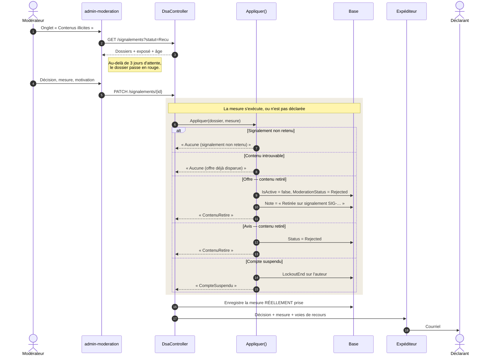

**Ce que le tracé a corrigé — le plus grave depuis le début.** La mesure
était **enregistrée et jamais appliquée**. Un modérateur choisissait
« Contenu retiré », le déclarant recevait un courriel le lui affirmant,
et l'annonce restait en ligne.

Ce n'est pas un oubli d'implémentation ordinaire : c'est le système qui
**ment dans un document juridique**. Le règlement impose une décision
motivée ; une décision qui se trompe sur la mesure prise est pire qu'une
absence de réponse, parce qu'elle clôt le dossier. Le déclarant n'a plus
de raison d'insister, et le contenu illicite reste.

Trois principes en découlent, visibles dans le diagramme :

- **`Appliquer` rend ce qui a été fait**, pas ce qui était demandé. Si le
  contenu a disparu entre-temps, ou si son type ne se traite pas
  automatiquement, la mesure redescend à « Aucune » **et le motif le
  dit**. C'est ce retour qui part dans le courriel.
- **Aucune mesure sur un signalement non retenu.** Retirer un contenu
  jugé licite serait exactement le sur-retrait par prudence que le
  règlement cherche à éviter.
- **Rien n'est supprimé, tout est masqué.** Une offre retirée garde ses
  candidatures, un compte suspendu est verrouillé et non effacé. Un
  signalement peut être jugé fondé à tort ; une suppression ne se défait
  pas.

---

## 13. Rouvrir une adresse bloquée

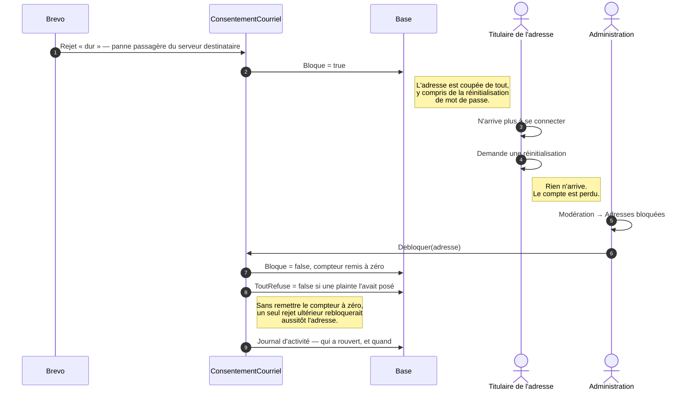

**Ce que le tracé a corrigé.** La liste montrait le problème sans offrir
le remède. Le blocage se déclenche sur un signal du prestataire, et ce
signal se trompe : une panne passagère remonte parfois en rejet dur. Or
l'adresse est alors coupée de la réinitialisation de mot de passe — qui
est précisément ce qu'on utilise quand on n'arrive plus à entrer. Le
compte était perdu pour son titulaire, sans recours.

---

## 14. Ouvrir et fermer une boîte de dialogue

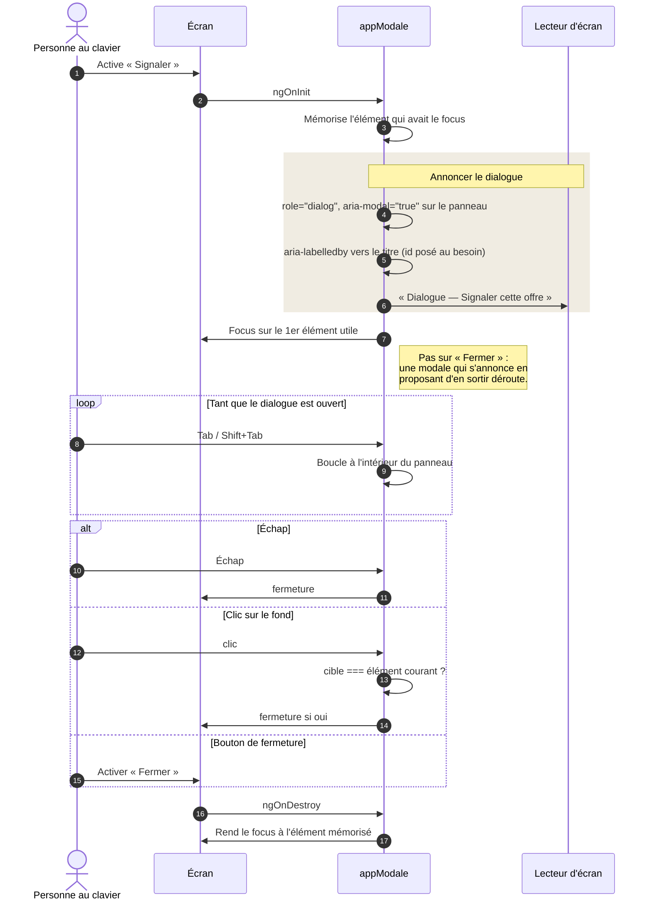

**Ce que le tracé a corrigé, en deux temps.**

*D'abord le clavier.* Les modales se fermaient d'un clic sur le fond, et
c'était la seule sortie. Au clavier, on n'y entrait même pas : la
tabulation continuait tranquillement à parcourir la page cachée
derrière. L'analyse statique signalait ces fonds comme « éléments
cliquables non focalisables » — la correction évidente aurait été de
leur poser un `tabindex`, ce qui aurait ajouté sept arrêts de tabulation
ne menant nulle part tout en faisant taire l'avertissement. Le manque
était ailleurs.

*Puis l'annonce.* Le piège de focus retient la tabulation, mais un
lecteur d'écran ne navigue pas qu'à la tabulation : en mode exploration,
il parcourait le document et lisait la page derrière la modale sans
jamais annoncer qu'une fenêtre s'était ouverte. La personne entendait un
formulaire de recherche pendant qu'un dialogue attendait sa réponse.
`role="dialog"`, `aria-modal` et `aria-labelledby` sont désormais posés
par la directive — sept modales, sept oublis possibles évités.

Le clic sur le fond, lui, est devenu une comparaison de cible : ce qui a
permis de supprimer les huit `(click)="$event.stopPropagation()"` qui ne
servaient qu'à annuler le gestionnaire du voile. Moins de code, et
l'accessibilité en plus.

---

## Ce que ces tracés n'ont pas encore couvert

- **Alertes de recherche et rappels d'entretien** — les catégories
  existent dans le centre de préférences, mais aucun courriel ne part
  encore pour elles. Le jour où ils partiront, ils devront passer par
  `ConsentementCourriel.Autorise()`, comme les candidatures et la lettre.
- **Rendu serveur** — tous les diagrammes ci-dessus supposent un
  navigateur qui exécute le JavaScript. Pour un robot qui ne l'exécute
  pas, la première étape rend une coquille vide. Voir
  `TODO-PROFESSIONNALISATION.md`, §1.
- **Encaissement réel** — le diagramme 2 décrit le tunnel complet ;
  `PrestatairePaiement` attend deux secrets pour l'ouvrir.
- **Multidiffusion effective** — le dépôt et le retrait sont écrits et
  testés, mais aucune destination n'est ouverte : France Travail demande
  une habilitation « dépôt d'offres » distincte de celle qui sert à lire
  le catalogue. Le tracé du retrait mérite d'être fait le jour où elle
  sera obtenue, parce que c'est lui qui protège les candidats — une
  offre pourvue restée en ligne ailleurs continue d'en recevoir.
- **Mesure d'audience** — le consentement par finalité est en place et
  le service de mesure l'interroge à chaque page ; aucune instance
  Matomo ou Plausible n'est encore déclarée, donc rien ne part.
